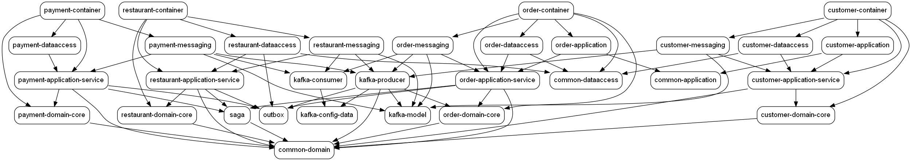
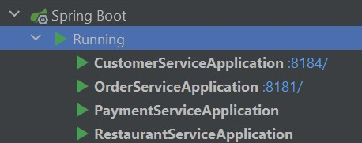
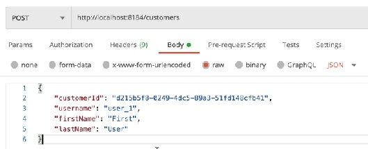
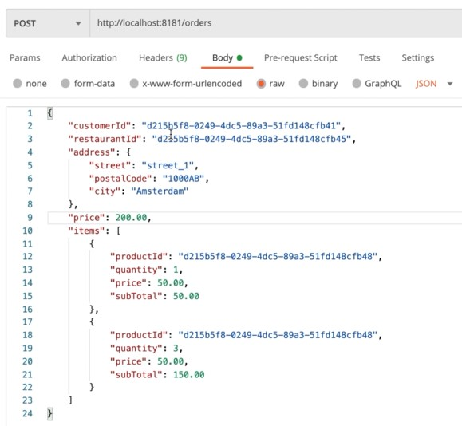

# Domain Driven Design and Microservices Demo :computer:
This is a Java Spring Boot demo project from [Ali Gelenler's Udemy course](https://www.udemy.com/course/microservices-clean-architecture-ddd-saga-outbox-kafka-kubernetes) showcasing basic and advanced architecture concepts such as:
- Clean &amp; Hexagonal Architecture
- Domain Driven Design (DDD)
- SAGA
- Outbox
- Command Query Responsibility Separation (CQRS)
- Containerization

---

# Tech Stack :rocket:
Building such a delicate and complex project requires various tools and frameworks. To achieve such a task, the following were used:
- Java Spring Boot
- Maven
- Mockito
- Apache Kafka
- Lombok
- Postgres
- Docker
- Kubernetes
- Confluent Helm
- Zookeeper

---

# Details :books:
To begin with, let's see the Dependency Graph of the whole project:

We can see that all the microservices live inside their containers and depend only on the `common-domain`. Their communication is orchestrated with the **SAGA** pattern
and messages are exchanged between them with **Outbox** pattern using **Apache Kafka**. **DDD** is implemented by making sure that each container can live on its own and
change independently. **Clean &amp; / or Hexagonal Architecture** can be achieved naturally while using DDD in a sensible way. On top of that, **CQRS** is used to have
better performance by separating read and write operations since we can scale each part separately. In an asychronous environment, we want to have an *eventual consistency*
on our system, and CQRS really help us achieve that.

---

# How to Run :runner:
1) In order to run this project, you have to install the following:
- Java
- Maven
- Docker

2) After having them installed and have Docker running, open the terminal in `food-ordering-system/infrastructure/docker-compose` and run the following command:
   `` docker-compose -f docker-compose.yml up ``. After that, you have to start the 4 different services (order-service, customer-service, restaurant-service,
   payment-service) either by opening the terminal in `food-ordering-system/{NAME}-service` and running `mvn spring-boot:run` or by using IntelliJ and run the
   {NAME}ServiceApplication in the container of each service manually. After having do so, you can check that everything is ok in IntelliJ by having the same
   services running as this picture:

3) Fire up your favourite API Platform (I use Postman) and do your tests:

- Create a customer

- Create an order with that customer

- Track your order's status

---

## PS1:
To avoid writing your requests' body on your own, you can use the appropriate files in `food-ordering-system/json-files`.

## PS2:
I will soon add a new branch with the Kubernetes setup.

